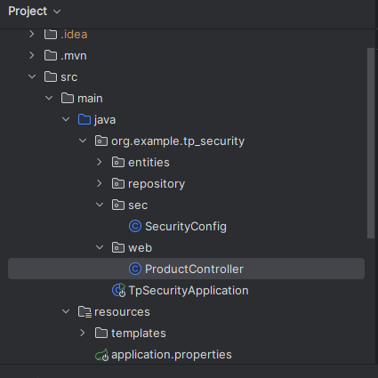
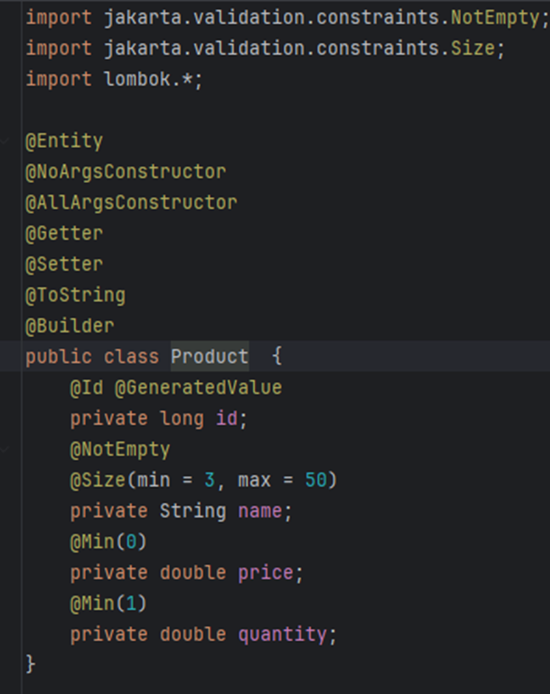
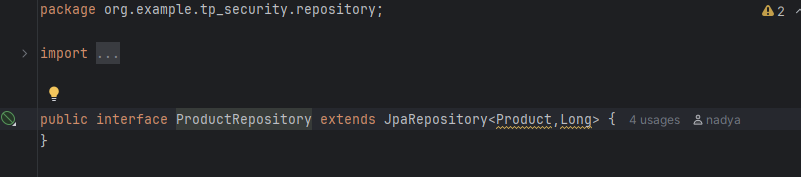
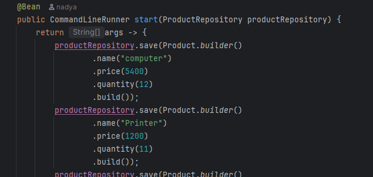
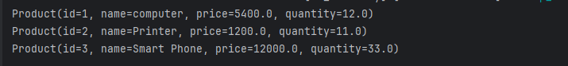
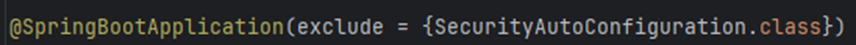

# 📌 TP Spring Boot 

Ce projet consiste à développer une application web Spring Boot permettant de **gérer une liste de produits** avec une interface Thymeleaf, une couche DAO basée sur Spring Data, la validation des formulaires et une sécurité personnalisée.

---


## 🏁 1. Création du projet Spring Boot

Créer un projet Spring Boot avec les dépendances suivantes :

* **Spring Web**
* **Spring Data JPA**
* **H2 Database**
* **MySQL Driver**
* **Thymeleaf**
* **Lombok**
* **Spring Security**
* **Spring Validation**


## 🗂️ 2. Créer l'entité JPA `Product`

Créer une classe `Product` annotée avec :


---

## 🧠 3. Créer l’interface `ProductRepository`

* Interface qui **hérite** de `JpaRepository<Product, Long>`
* Permet d’effectuer des opérations CRUD sans implémentation manuelle



## 🧪 4. Tester la couche DAO

Dans `CommandLineRunner`, insérer quelques produits :

Puis afficher les données dans la console pour vérifier le fonctionnement :

```java
productRepository.findAll().forEach(System.out::println);
```

---


## 🔓 5. Désactiver la protection par défaut de Spring Security


Créer une classe de configuration :

```java
@Configuration
public class SecurityConfig {

    @Bean
    public SecurityFilterChain filterChain(HttpSecurity http) throws Exception {
        http.formLogin().disable()
            .authorizeHttpRequests(auth -> auth.anyRequest().permitAll());
        return http.build();
    }
}
```

---

## 🖥️ 6. Spring MVC + Thymeleaf

Créer un contrôleur MVC (`ProductController`) et les vues Thymeleaf.

### 🔹 Afficher la liste des produits

* Page : `products.html`
* Récupération via `productRepository.findAll()`

### 🔹 Supprimer un produit

* URL : `/delete/{id}`
* Redirection vers la liste

### 🔹 Template Thymeleaf + Bootstrap

Créer un layout global :
`templates/layout.html` avec `th:fragment`

Puis faire hériter d’autres pages via `th:replace`.

### 🔹 Ajouter un produit + Validation

* Formulaire HTML utilisant `${product}`
* Annotation Spring Validation :
  `@Valid`, `BindingResult`
* Message d’erreur via `th:errors`

---

## 🔐 7. Sécuriser l’application

Activer Spring Security avec :

* Formulaire d’authentification
* Comptes utilisateurs en mémoire
* Restrictions d’accès (ex. : suppression réservée à ADMIN)

Exemple :

```java
.authorizeHttpRequests(ar->ar.requestMatchers("/user/**").hasRole("USER"))
        .authorizeHttpRequests(ar->ar.requestMatchers("/admin/**").hasRole("ADMIN"))
```

